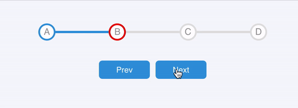

# react-minimal-progress-steps

> react-minimal-progress-steps

[](https://www.npmjs.com/package/react-minimal-progress-steps) [](https://standardjs.com)

<div align="center">
    
</div>

## Install

```bash
npm install --save react-minimal-progress-steps
```

## Usage

```jsx
import React from 'react'
import ReactMinimalProgressSteps from 'react-minimal-progress-steps'
import 'react-minimal-progress-steps/dist/index.css'

const data = [
  { id: 1, content: 'A' },
  { id: 2, content: 'B' },
  { id: 3, content: 'C' },
  { id: 4, content: 'D' }
]

const App = () => {
  const [selectedItemId, setSelectedItemId] = React.useState(1)
  return (
    <div style={{ width: 400, height: 400, margin: 40 }}>
      <ReactMinimalProgressSteps
        data={data}
        selectedItemId={selectedItemId} // send an item id as props
        returnSelectedItemId={setSelectedItemId} // returns selected item's id
      />
    </div>
  )
}

export default App
```

## inspiration

Traversy Media

## License

MIT © [alithecodeguy](https://github.com/alithecodeguy)
